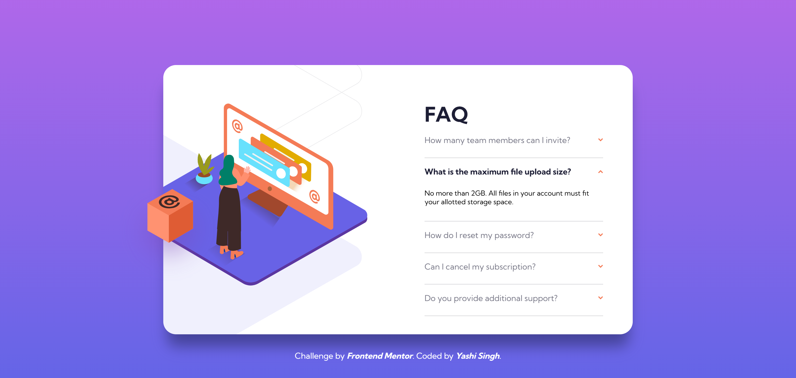
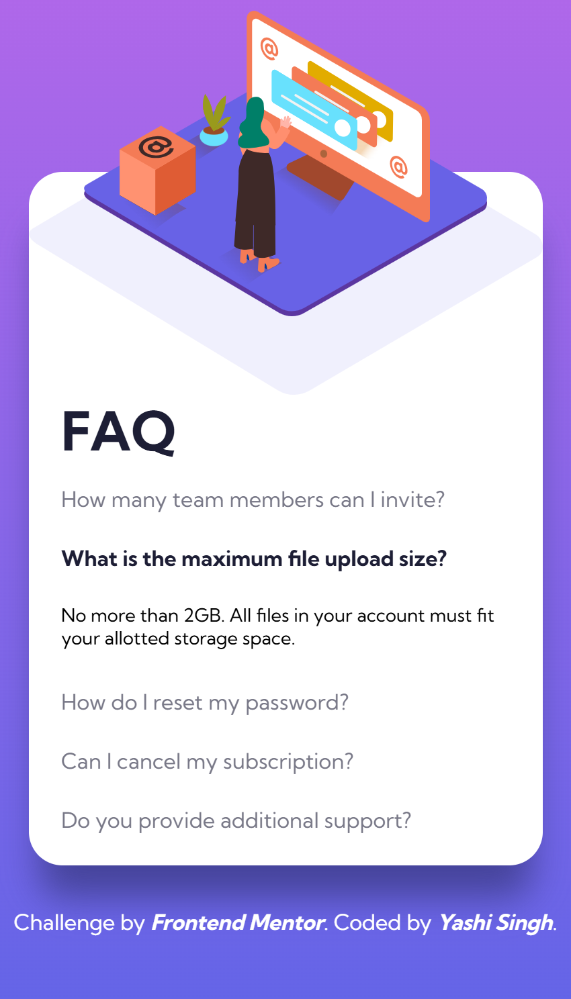

# Frontend Mentor - FAQ Accordion Card Solution

This is a solution to the [FAQ Accordion Card Challenge on Frontend Mentor](https://www.frontendmentor.io/challenges/faq-accordion-card-XlyjD0Oam). Frontend Mentor challenges help you improve your coding skills by building real-world projects.  

## 📑 Table of Contents

- [Overview](#overview)
  - [The Challenge](#the-challenge)
  - [Screenshot](#screenshot)
  - [Links](#links)
- [Installation & Setup](#installation--setup)
- [My Process](#my-process)
  - [Built With](#built-with)
  - [What I Learned](#what-i-learned)
  - [Continued Development](#continued-development)
  - [Useful Resources](#useful-resources)
- [Author](#author)
- [Acknowledgments](#acknowledgments)

---

## 📝 Overview

### 🎯 The Challenge

Users should be able to:

- View the optimal layout depending on their device's screen size.
- See hover states for all interactive elements.
- Expand/collapse answers when clicking a question.

### 📸 Screenshot

**Desktop Design**



**Mobile Design**



### 🔗 Links

- **Solution URL:** [Frontend Mentor Solution](https://your-solution-url.com)
- **Live Site URL:** [Live Demo](https://your-live-site-url.com)

---

## ⚙️ Installation & Setup

### **1️⃣ Install LESS Compiler**
Since this project uses **LESS** for styling, you'll need to compile it into standard CSS.

#### **🔹 Option 1: Using Node.js (Recommended)**
1. Install [Node.js](https://nodejs.org/) if you haven't already.
2. Open the terminal and install LESS globally:
   ```sh
   npm install -g less
   ```
3. Navigate to the project directory and compile the LESS file:
   ```sh
   lessc style.less style.css
   ```
4. Open `index.html` in your browser.

#### **🔹 Option 2: Using Live LESS Compiler (VS Code)**
1. Install the **Live LESS Compiler** extension from the VS Code marketplace.
2. Open your project in VS Code.
3. Click the **"Watch LESS"** button at the bottom of the editor.
4. The compiler will automatically generate a `style.css` file from `style.less`.

---

## 🚀 My Process

### 🏗️ Built With

- **Semantic HTML5** markup  
- **LESS (CSS Preprocessor)**  
- **CSS Flexbox & Grid**  
- **Vanilla JavaScript (ES6+)**  
- **Mobile-first workflow**  

### 📚 What I Learned

While working on this challenge, I improved my understanding of:

1. **LESS Nesting & Variables:**
   ```less
   @soft-red: hsl(14, 88%, 65%);
   
   .accordion-button {
       color: @soft-red;
       &:hover {
           font-weight: bold;
           color: darken(@soft-red, 10%);
       }
   }
   ```

2. **JavaScript Accordion Functionality:**
   ```js
   document.querySelectorAll(".accordion-header").forEach(header => {
       header.addEventListener("click", function () {
           this.classList.toggle("active");
           this.nextElementSibling.style.display = 
               this.classList.contains("active") ? "block" : "none";
       });
   });
   ```

### 🔮 Continued Development

- Improve **ARIA accessibility** for screen readers.
- Convert project to **React** with dynamic FAQ items.
- Use **GSAP animations** for smooth transitions.

### 🔗 Useful Resources

- [LESS Official Docs](https://lesscss.org/) - Helped with understanding nesting and variables.
- [CSS Tricks - Flexbox](https://css-tricks.com/snippets/css/a-guide-to-flexbox/) - Great for positioning elements.

---

## ✍️ Author

- Frontend Mentor - [Yashi-Singh-9](https://www.frontendmentor.io/profile/Yashi-Singh-9)  
- LinkedIn - [Yashi Singh](https://www.linkedin.com/in/yashi-singh-b4143a246) 
---

## 🎖️ Acknowledgments

Big thanks to **Frontend Mentor** for providing awesome coding challenges! 💙  